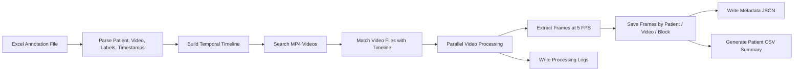

# Endonasal Surgical Video Frame Extraction Pipeline

**Author:** Dilip Goswami  
**Script:** `ImageExtraction.py`

## Overview

This repository contains a Python-based preprocessing pipeline for extracting image frames from temporally annotated endonasal surgery videos.

The script reads an Excel annotation file containing patient IDs, video file names, block labels, and start/end timestamps. It then matches those annotations with corresponding `.mp4` video files and extracts frames from each labeled temporal block at a fixed rate of **5 frames per second (FPS)**.

The extracted frames are saved in a structured dataset layout organized by patient, video, and anatomical or procedural block label. The pipeline also generates per-block metadata, patient-level CSV summaries, missing-video reports, and processing logs for traceability and quality control.

---

## Purpose

Medical and surgical video datasets often require careful preprocessing before they can be used for computer vision or deep learning tasks. This pipeline converts temporally annotated surgical videos into organized frame-level image datasets suitable for:

- surgical scene understanding,
- anatomical structure recognition,
- segmentation and classification workflows,
- medical computer vision dataset preparation,
- frame-level model training,
- quality-control analysis of annotated video blocks.

---

## Key Features

- Reads temporal video annotations from an Excel spreadsheet
- Supports multiple timestamp formats
- Matches annotated patient/video entries with `.mp4` files
- Extracts frames at a fixed rate of **5 FPS**
- Handles small timing gaps between consecutive annotation blocks
- Skips invalid or out-of-range video segments
- Trims block end times if they exceed video duration
- Processes multiple videos in parallel using multiprocessing
- Saves extracted frames in a patient/video/block hierarchy
- Generates a `metadata.json` file for each extracted block
- Creates patient-level CSV extraction summaries
- Logs processing status, warnings, and missing/unreadable videos

---

## Project Structure

Recommended repository structure:

```text
endonasal-video-frame-extraction/
├── ImageExtraction.py
├── README.md
├── requirements.txt
└── .gitignore
```

Example output structure generated by the script:

```text
Splitted Images/
├── process.log
├── missing_videos.txt
├── PATIENT_01/
│   ├── PATIENT_01_block_summary.csv
│   └── PATIENT_01_VIDEO_01/
│       ├── ANATOMICAL_BLOCK_A/
│       │   ├── PATIENT_01_VIDEO_01_ANATOMICAL_BLOCK_A_0001.jpg
│       │   ├── PATIENT_01_VIDEO_01_ANATOMICAL_BLOCK_A_0002.jpg
│       │   └── metadata.json
│       └── ANATOMICAL_BLOCK_B/
│           ├── PATIENT_01_VIDEO_01_ANATOMICAL_BLOCK_B_0001.jpg
│           └── metadata.json
└── PATIENT_02/
    └── ...
```

---

## Input Requirements

### 1. Excel Annotation File

The script expects an Excel file containing:

- patient identifier,
- video file name,
- temporal block start and end times,
- corresponding block labels.

The pipeline processes rows in pairs:

```text
Row 1: Patient/video information and timestamp values
Row 2: Corresponding labels for the timestamp blocks
```

The script automatically forward-fills missing patient IDs and normalizes column names related to patient and video file names.

### 2. Video Directory

The video directory should contain `.mp4` files. The script searches recursively through the directory and ignores hidden macOS metadata files such as:

```text
._filename.mp4
```

The patient ID is inferred from the video filename using the first underscore-separated component:

```text
PATIENT01_video_name.mp4
```

becomes:

```text
Patient ID: PATIENT01
Video name: PATIENT01_video_name
```

### 3. Output Directory

All extracted frames, logs, summaries, and metadata files are written to the configured output directory.

---

## Configuration

The main paths and extraction frame rate are defined near the top of `ImageExtraction.py`:

```python
FPS = 5
FRAME_INTERVAL = 1 / FPS

EXCEL_PATH = r"/path/to/annotation_file.xlsx"
VIDEO_DIR = r"/path/to/video_directory"
OUTPUT_DIR = r"/path/to/output_directory"
```

Update these paths before running the script.

---

## Installation

Create and activate a Python virtual environment:

```bash
python -m venv venv
source venv/bin/activate
```

On Windows:

```bash
python -m venv venv
venv\Scripts\activate
```

Install the required dependencies:

```bash
pip install pandas pillow moviepy openpyxl
```

Optional `requirements.txt`:

```text
pandas
pillow
moviepy
openpyxl
```

---

## Usage

After updating the input and output paths in `ImageExtraction.py`, run:

```bash
python ImageExtraction.py
```

The script will:

1. Load the Excel annotation file.
2. Build a timeline of labeled temporal blocks.
3. Search recursively for matching `.mp4` video files.
4. Process matched videos in parallel.
5. Extract frames from each labeled block at **5 FPS**.
6. Save frames, metadata, logs, and CSV summaries.

---

## Processing Workflow



---

## Timestamp Handling

The script supports several timestamp formats, including:

```text
12.5
01:20
00:01:20
datetime.time objects
```

Examples:

```text
01:20     → 80 seconds
00:01:20 → 80 seconds
12.5      → 12.5 seconds
```

Small gaps between consecutive blocks are adjusted when the gap is greater than `0.1` seconds and less than or equal to `1.0` second. This helps reduce the risk of losing frames between adjacent annotation blocks.

---

## Output Files

### Extracted Frames

Frames are saved as `.jpg` files using the following naming convention:

```text
<video_name>_<block_label>_<frame_number>.jpg
```

Example:

```text
PATIENT01_VIDEO01_NASAL_CAVITY_0001.jpg
```

### Metadata

Each extracted block contains a `metadata.json` file:

```json
{
  "start_sec": 10.0,
  "end_sec": 20.0,
  "frames": 50
}
```

### Patient Summary CSV

For each patient, the script generates:

```text
<PATIENT_ID>_block_summary.csv
```

The CSV contains:

```text
Video File, Block, Start Time, End Time, Duration(s), Frames
```

### Processing Log

A global log file is saved as:

```text
process.log
```

It includes matched videos, skipped blocks, frame extraction warnings, missing files, and completion status.

### Missing Videos Report

If any videos cannot be opened, the script creates:

```text
missing_videos.txt
```

## Example Use Case

This pipeline was designed for preprocessing temporally annotated endonasal surgical videos into frame-level image datasets. The extracted images can support downstream medical computer vision tasks such as anatomical recognition, surgical phase analysis, segmentation, and training-data preparation for deep learning models.


