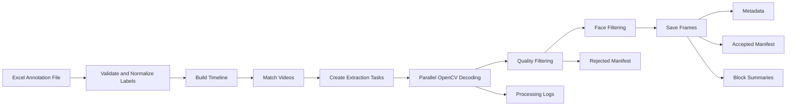

# Endoscopic Surgical Video Frame Extraction Pipeline

**Author:** Dilip Goswami, MSc  
**Institution:** TU Berlin  
**Script:** `ImageExtraction.py`

## Overview
This repository contains a preprocessing pipeline for extracting image frames from temporally annotated endoscopic surgical videos.

The pipeline reads surgeon-annotated Excel files containing anatomical or procedural time blocks, matches them to source videos, and extracts image frames at a user-defined frame rate.

Unlike traditional extraction approaches that rely on random seeking or keyframe jumps, this implementation uses sequential OpenCV decoding only, ensuring frame-accurate alignment with annotated timelines and reducing label drift.

The pipeline supports multiprocessing, resumable extraction, quality filtering, face filtering, metadata generation, audit manifests, and robust handling of variable-frame-rate (VFR) recordings.

## Purpose
Annotated surgical videos must often be transformed into structured image datasets before they can be used for machine learning and computer vision research.

This pipeline creates reproducible frame-level datasets suitable for:
*   Surgical scene understanding
*   Anatomical structure classification
*   Surgical workflow analysis
*   Deep learning dataset generation
*   Medical computer vision research
*   Quality-control and annotation validation

## Key Features

### Annotation Processing
*   Reads temporal annotations from Excel files
*   Dynamically groups annotations by patient and video
*   Does not depend on rigid row ordering
*   Validates annotation structure before extraction
*   Supports multiple timestamp formats

### Frame Extraction
*   User-selectable extraction FPS
*   Sequential OpenCV decoding only
*   No MoviePy dependency
*   No random frame seeking
*   No keyframe snapping artifacts
*   Supports variable-frame-rate (VFR) videos
*   Optional boundary trimming around annotation intervals

### Label Handling
Canonical normalization of annotation labels:

| Raw Annotation Examples | Normalized Label |
| :--- | :--- |
| FACE + BLOCK 1 <br> FACE + BLOC 1 | BLOCK_1 |
| BLOCK 2 + FACE | BLOCK_2 |
| BLOCK 3 LEFT + FACE | BLOCK_3 |

Non-training labels such as `MIRE + FACE` are automatically excluded.

### Quality Filtering
Optional frame rejection based on:
*   Mean image intensity
*   Overexposed images
*   Underexposed images
*   Laplacian variance blur detection

Rejected frames are logged and included in audit manifests.

### Face Filtering
Optional Haar-cascade based face rejection:
*   Applies only to FACE-marked intervals (default)
*   Can optionally be applied to all extracted frames
*   Supports frontal and profile face cascades

### Resume Support
*   Safe restart after interruption
*   Per-block metadata tracking
*   Skips already completed blocks
*   Optional forced re-extraction

### Parallel Processing
*   Multiprocessing support
*   Automatic worker selection
*   Configurable worker count
*   Load-balanced processing

### Auditability
Generates:
*   Per-block metadata
*   Block summaries
*   Accepted-frame manifests
*   Rejected-frame manifests
*   Processing logs

## Project Structure
```text
endoscopic-frame-extraction/
├── ImageExtraction.py
├── README.md
├── requirements.txt
└── .gitignore

```

Example output:

```text
output/
├── process.log
├── global_block_summary.csv
├── global_accepted_frame_manifest.csv
├── global_rejected_frame_manifest.csv
├── PATIENT_01/
│   ├── PATIENT_01_block_summary.csv
│   └── VIDEO_01/
│       ├── BLOCK_1/
│       │   ├── VIDEO_01_BLOCK_1_0001.jpg
│       │   ├── VIDEO_01_BLOCK_1_0002.jpg
│       │   └── metadata.json
│       ├── BLOCK_2/
│       └── ...
└── PATIENT_02/

```

## Installation

Create a virtual environment:

```bash
python -m venv venv
source venv/bin/activate

```

*(Windows)*:

```cmd
venv\Scripts\activate

```

Install dependencies:

```bash
pip install pandas openpyxl opencv-python

```

Example `requirements.txt`:

```text
pandas
openpyxl
opencv-python

```

## Usage

The script is fully command-line driven.

### Required Arguments

```bash
python ImageExtraction.py \
  --excel_path annotations.xlsx \
  --video_dir videos \
  --output_dir output

```

### Example

```bash
python ImageExtraction.py \
  --excel_path annotations.xlsx \
  --video_dir ./videos \
  --output_dir ./output \
  --fps 5 \
  --workers 8 \
  --jpeg_quality 95

```

## Command Line Options

### Extraction

* `--fps`
Target extraction frame rate. Default: `5`
* `--jpeg_quality`
JPEG quality from 1 to 100. Default: `95`

### Boundary Trimming

* `--boundary_buffer_sec`
Trim both start and end of every annotation interval.
*Example:* `--boundary_buffer_sec 0.25` removes 250 ms from both ends.

### Multiprocessing

* `--workers`
Number of worker processes. `0` = automatic.

### Resume Control

* `--force_reextract`
Ignore existing metadata and regenerate all outputs.

### Quality Filtering

Enable quality filtering: `--enable_quality_filter`
Optional thresholds:

* `--min_mean_intensity` (Default: 15)
* `--max_mean_intensity` (Default: 240)
* `--min_laplacian_var` (Default: 50)

### Face Filtering

Enable face rejection: `--enable_face_filter`

* Apply only to FACE-marked intervals: `--face_filter_scope marked`
* Apply to all extracted frames: `--face_filter_scope all`

Additional tuning:

* `--face_scale_factor`
* `--face_min_neighbors`
* `--face_min_size`

### Timing Modes

**Presentation Time (Recommended)**

* `--timing_mode presentation_time`
Uses `CAP_PROP_POS_MSEC`. Recommended for VFR videos, clinical recordings, and mixed recording sources.

**Frame Index**

* `--timing_mode frame_index`
Uses timestamp × source FPS. Recommended only for strictly fixed-frame-rate videos.

**Timestamp Formats**
Supported formats include: `12.5`, `01:20`, `00:01:20`, `datetime.time`.
Ambiguous two-field timestamps can be interpreted using:

* `--two_field_time_format mm:ss` (Default)
* `--two_field_time_format hh:mm`
* `--two_field_time_format reject`

## Output Files

### Metadata

Each extracted block contains a `metadata.json` with keys tracking the extraction state:

```json
{
  "original_start_sec": 10.0,
  "original_end_sec": 20.0,
  "planned_frame_count": 50,
  "processed_frame_count": 50,
  "accepted_frame_count": 50,
  "rejected_frame_count": 0,
  "completed": true
}

```

### Block Summary

* Per-patient summaries: `<PATIENT_ID>_block_summary.csv`
* Global Block Summary: `global_block_summary.csv` (Contains extraction statistics across all videos).

### Manifests

* **Accepted Frame Manifest**: `global_accepted_frame_manifest.csv` (Tracks every saved frame).
* **Rejected Frame Manifest**: `global_rejected_frame_manifest.csv` (Tracks all rejected frames and reasons).

### Processing Log

`process.log` includes video matching, extraction progress, warnings, skipped intervals, filtering decisions, and processing failures.

### Missing or Unreadable Videos

If videos are missing, unreadable, or fail during decoding, the script writes:

```text
missing_or_unreadable_videos.txt

```

## Processing Workflow



## Design Principles

This implementation was designed to support reproducible medical AI research by emphasizing:

* frame-accurate temporal alignment
* deterministic extraction
* auditability
* resumability
* robust handling of clinical video data

```
